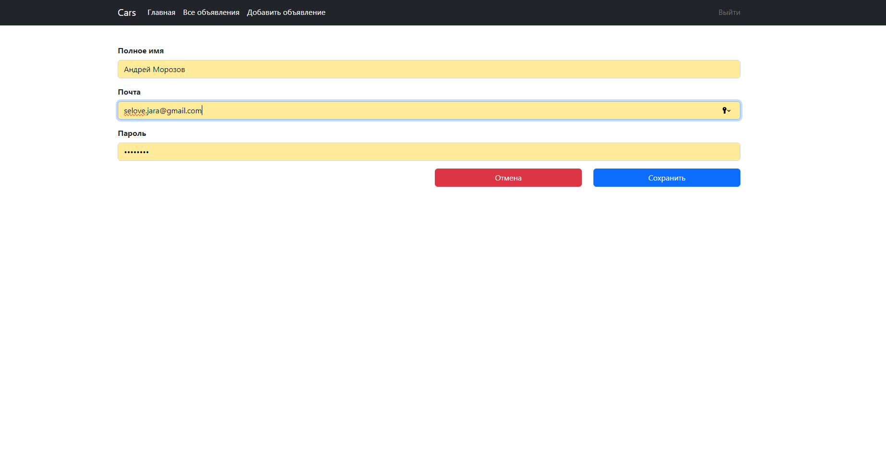
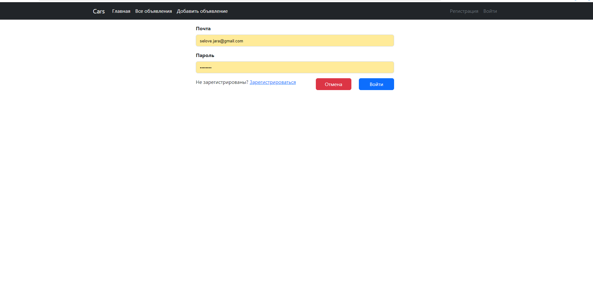
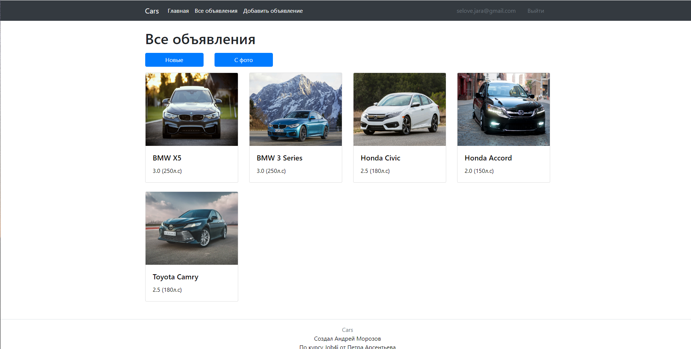

# job4j_cars

## Описание проекта
Этот проект представляет собой веб-приложение для просмотра объявлений о продаже автомобилей. 
Пользователи ознакомиться с подробными описаниями, фотографиями и информацией о марке
и типе кузова автомобиля. Каждое объявление имеет статус, указывающий, доступен ли автомобиль для продажи или уже продан.

## Взаимодействие с приложением
### Web интерфейс
- Страница со всеми объявлениями автомобилей. На которой есть возможность показать свежиее объявления или только с фото.
- Нажимая на объявления, вы переходите на страницу с подробным описанием автомобиля. Там же у владельца объявления есть кнопка "Продано", при нажатии на которую объявление скрывается у других пользователей.
- При добавлении объявления можно ввести название, описание, добавить фотографии, а также выбрать значения из выпадающих списков для марки, модели, кузова, категории и т.д.


## Стек технологий
- **Java 21** - основной язык программирования
- **Spring Boot 2.7.6** - фреймворк для создания приложений
- **Thymeleaf** - шаблонизатор для построения HTML-страниц
- **PostgreSQL 42.5.1** - БД
- **Liquibase 4.15.0** - инструмент для миграций базы данных
- **Maven 3.8** - система управления зависимостями

## Требования к окружению
Для запуска проекта необходимо установить следующее ПО:
- **Java 21**
- **Maven 3.8**
- **PostgreSQL 42.5.1**

## Запуск проекта
1. Склонируйте репозиторий:
2. Создайте базу данных PostgreSQL :
3.  Настройте доступ к базе данных в файле `hibernate.cfg.xml:
4. Соберите и запустите проект:
 ```
   mvn spring-boot:run
   ```

## Контакты
- Email: selove.jara@gmail.com
- Telegram: https://t.me/Moroz_koo

## Фото проекта

<div style="display: flex; flex-wrap: wrap; gap: 20px;">
    <div>
        
        
        <p>Страница регистрации и входа, где пользователи могут ввести свои учетные данные для доступа к приложению.</p>
    </div>
    <div>
        
        <p>Страница приложения, где отображается список объявлений.</p>
    </div>
    <div>
        
        
        <p>Страница добавления нового объявления, позволяющая пользователю ввести необходимые детали.</p>
    </div>
    <div>
        
        
        <p>Подробная информация о автомобиле, а так же кнопка "Продано"</p>
    </div>
</div>